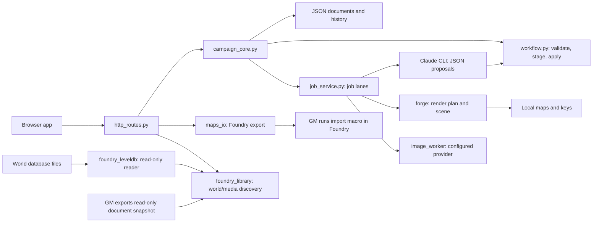

# Architecture

Campaign Studio is a single-user local app. Python serves static browser files and JSON APIs; no database
or frontend compilation is required. Runtime files are ignored by Git and excluded from release archives.

## Modules

| File                                  | Responsibility                                                                     |
| ------------------------------------- | ---------------------------------------------------------------------------------- |
| `DM/server.py`                        | Local server startup, interrupted-job recovery and worker threads                  |
| `DM/http_routes.py`                   | HTTP routes, request validation, response handling and static files                |
| `DM/campaign.py`                      | Where the active campaign's files live; inherited by job subprocesses (`DM_HOME`)  |
| `DM/campaign_core.py`                 | Document revisions/history, map workflows and campaign-specific job results        |
| `DM/job_service.py`                   | Queueing, subprocess execution, persistent job records, logs and restart detection |
| `DM/config.py`                        | Local settings, world manifest and Data directory detection                        |
| `DM/foundry_backup.py`                | Offline full User Data copy, SHA-256 verification and restore copy receipts        |
| `DM/foundry_upgrade.py`               | Upgrade workflow: inventory, clone evidence, migration audit and cutover review    |
| `DM/foundry_compat.py`                | Shared build, version and package relationship rules                               |
| `DM/foundry_catalog.py`               | Official Foundry release and package metadata collection                           |
| `DM/foundry_solver.py`                | Compatible build and dependency selection                                          |
| `DM/foundry_library.py`               | Local world discovery, media browsing and validated document snapshots             |
| `DM/foundry_leveldb.py`               | Read-only, standard-library reader for the active LevelDB files of a v11+ world    |
| `DM/storage.py`                       | Atomic JSON replacement and cooperating thread/process locks                       |
| `DM/commits.py`                       | Write-ahead journal that completes interrupted multi-document changes              |
| `DM/schema.py`, `DM/migrate.py`       | Data schema version, migrations, verified pre-migration backups and restore        |
| `DM/shapes.py`                        | Each stored record's fields and defaults, defined once for Python and the browser  |
| `DM/workflow.py`                      | Map proposal schemas, layout DSL, stale checks, staging and content apply          |
| `DM/request_workflow.py`              | General request schema, input fingerprint, validation and idempotent apply         |
| `DM/revisions.py`                     | Map plan/key/brief checkpoints, preview and restore                                |
| `DM/maps_io.py`                       | Image-map import and complete exports to the selected Foundry Data directory       |
| `DM/forge/forge.py`                   | Plan parser, wall/light geometry, scene exports and catalogue registration         |
| `DM/forge/generate.py`, `gen_city.py` | Procedural generator registry and city layout generation                           |
| `DM/forge/render2d.py`, `roofs.py`    | Deterministic tiled raster painting and roof geometry                              |
| `DM/tools/image_worker.py`            | One configured image request; parent server applies its result                     |
| `DM/app/merge.js`                     | Copy/compare helpers, new records from shapes and the three-way autosave merge     |
| `DM/app/state.js`                     | API access, document cache, revision-aware autosave and polling                    |
| `DM/app/controls.js`                  | Shared DOM, form, picker, dialog and feedback controls                             |
| `DM/app/campaign-pages.js`            | Codex, threads, session prep, inbox and handout pages                              |
| `DM/app/map-pages.js`                 | Map creation, editing and proposal review pages                                    |
| `DM/app/world-pages.js`               | World map page: upload an image, pin battle maps onto it                           |
| `DM/app/foundry-pages.js`             | Foundry setup, backup and upgrade views                                            |
| `DM/app/studio.js`                    | Studio shell, dashboard, World Library, settings and image queue                   |
| `DM/app/app.js`                       | Route dispatch and startup; one abortable view context per navigation              |
| `DM/packaging_source.py`              | Explicit source manifest archive and SHA-256 checksum                              |

`http_routes.ROUTES` maps methods and paths to focused handlers. The dispatcher converts typed
`Invalid`, `NotFound` and `Conflict` errors into JSON responses with 400, 404 and 409 statuses. Domain
validation errors are normalized at this boundary; document revision conflicts retain the latest document
and revision in their response.

The `DM` directory name and `wotg-maps`/`wotgForge` export identifiers are compatibility names. They do not
require the original campaign. Change export identifiers only with a migration for existing scenes.

## Persistence and concurrency

Settings, codex, threads, art, inbox, prep, workflows and jobs live under `DM/data`. A map's plan, key,
generated files and checkpoints live under `DM/maps/<slug>`. Images live in `DM/uploads`.

Browser document saves use `X-Rev` and return HTTP 409 plus the latest document on conflict. The browser
merges edits by stable object IDs. Previous document versions are retained under `data/.history` (50 per
document). Server route mutations use a reentrant lock. Shared map catalogue read/modify/write holds a
`storage.file_lock`, which also coordinates forge subprocesses on Windows and POSIX. JSON replacement uses
unique temporary files. External editors must cooperate with this lock to avoid lost updates.

Changes that span documents (content and request application, layout application, revision restore
and generated-image links) go through `campaign_core.commit_docs`. Before the first write, the journal in
`data/.commits` durably records every target's new value and a digest of the bytes it replaces. Put the
record that marks the change finished (workflow or request status) last. If the server stops part way,
startup replays the entry: targets still holding their old bytes are completed and targets already written
are left alone. Each target is flushed to disk before the entry is deleted, so a power cut cannot leave a
journaled document truncated without a record to recover it from. Only the server replays entries:
`python DM/migrate.py --apply` refuses while one is pending, because replaying can queue a render. Every write request and job result also replays pending entries first, so no change starts
from a half-applied state. Follow-up steps recorded with a change (queueing the render after a layout apply
or restore, marking the map catalogue populated) run once its documents are written, and again on replay;
they are idempotent and best effort. If a target was changed some other way, nothing is overwritten; the
entry is set aside and shown on the dashboard for GM review. A damaged journal record is set aside the same
way, so it never blocks later changes. Stable workflow-derived IDs and retry checks remain a second
guard against duplicates. Map import/export are not journaled: they create files that later steps tolerate.
Back up `DM/data`, `DM/maps` and `DM/uploads` together before upgrades.

## Data schema and migrations

`data/.schema.json` records the campaign's data schema (`schema.CURRENT`). Existing data without it is
schema 0 (0.1.x). A new campaign records the current schema just before its first document is written, so
an older build refuses it; data copied into a campaign before its first write is still migrated. On startup the
server refuses data from a newer schema, completes interrupted changes, then migrates older data. When a
migration changes documents, every document it may rewrite is first copied to `DM/backups` and each copy is
verified by SHA-256. Migrations fill or reshape stored documents only. They are idempotent, migrated
documents are flushed to disk before the version is recorded, and an interrupted migration runs again from
a new backup. A retry's backup names the first attempt and is marked partly migrated; the pending record is
cleared once the schema version is recorded, including after an interrupted cleanup. `python DM/migrate.py`
reports pending changes, `--apply` migrates and
`--restore DM/backups/<name>` returns documents to a backup's version.

### Record shapes

`DM/shapes.py` defines each stored record once: the fields a new one needs, the defaults for the rest and
the shapes of the records in its lists (a map key's areas, an area's journal entries). Apply paths build
records with `Shape.new`, and the browser builds them with `blank(kind, fields)` from `GET /api/shapes`.
Links and provenance such as `map`, `area`, `workflow` or `request` are optional extra fields.

| Document                   | Shape        | Records in its lists                                                 |
| -------------------------- | ------------ | -------------------------------------------------------------------- |
| `data/codex.json`          | `codex`      | codex entries                                                        |
| `data/threads.json`        | `threads`    | threads                                                              |
| `data/art.json`            | `art`        | art items                                                            |
| `data/world-maps.json`     | `world_maps` | world maps and their pins (positions are 0-1 fractions of the image) |
| `data/prep/<session>.json` | `prep`       | scenes, handouts, checklist items, loot                              |
| `maps/<slug>/key.json`     | `map_key`    | areas (with journal entries, events, loot), events                   |

Migrations complete stored documents with `Shape.fill_all`, filling only missing or null fields; existing
values, unknown fields and other documents are kept. Schema 1 completed codex entries, threads, prep,
scenes, map keys and areas; schema 2 completed every shaped record. Adding a field to a shape changes
`shapes.fields_digest()`, and `tests/test_shapes.py` fails until a new schema version fills it and
`schema.SHAPES_DIGEST` is updated. Renaming or removing a field needs its own migration and fixture test.

## Workflows and jobs

| Object       | States                                                           |
| ------------ | ---------------------------------------------------------------- |
| Workflow     | queued/ready → running → review → applied; failed can be retried |
| Request      | new → doing → review → done; interrupted drafts return to new    |
| Job          | queued → running → done or failed                                |
| Image brief  | queued → generating → ready or failed                            |
| Story thread | open, planned, foreshadowed, resolved (GM managed)               |

Layout/content proposals are validated against a bounded schema. Layout fingerprints cover plan bytes
and numbered location identities/coordinates; changes make old proposals stale. They do not fingerprint
all codex text. Applying a layout checkpoints the map, then queues a render; applying content links entries,
journals, events, threads and art briefs. The model never calls persistence directly in structured workflows.
General Requests stage bounded JSON for codex entries, threads and session prep. The GM reviews additions
before applying; stable request-prefixed IDs and a prep application marker make interrupted writes retryable.
Editing request text or session after drafting invalidates the proposal.

One worker runs per lane (forge, Claude, art). Lanes may run concurrently. `JobService` persists queue and
process transitions; application callbacks settle image, workflow and inbox documents. State postprocessing
happens under the server lock, before the job is reported complete. Exceptions fail the job and leave its
worker available. On restart, the server checks the data schema, completes interrupted changes and migrates
before saved unfinished jobs are marked failed; the queue does not automatically resume.
Only one server instance should operate on a campaign. Direct CLI tools must not edit a map while the app
is rendering that map.

## APIs and providers

- `GET /api/state`, `/api/settings`, `/api/jobs`, `/api/doc/<name>` return local state; `/api/shapes`
  returns the stored record shapes.
- `PUT /api/doc/<name>` uses `X-Rev` and refuses application-owned documents (`settings`, `workflows/*`,
  `jobs/*`) with 403; `PUT /api/plan/<slug>` checkpoints a valid plan.
- `POST /api/maps/create`, `/api/maps/import` create maps; `/api/maps/<slug>/populate|revise` create workflows.
- `/api/workflow/<id>/pack` exports prompt/schema; POST `run|stage|feedback|apply` operates on a proposal.
- `/api/requests/<id>/pack` exports a request prompt/schema; POST `run|stage|apply` operates on its draft.
- `/api/maps/<slug>/checkpoint|restore|export` manages iteration and Foundry preparation.
- `/api/upload-image`, `/api/art/generate` handle uploaded/generated artwork.
- `/api/package` builds the public source allowlist; it never packages runtime content.
- `GET /api/state` lists interrupted changes awaiting review; POST `/api/commits/<id>/dismiss` hides one
  and keeps its saved values on disk.

Writes require `X-DM-Site: 1`. Only localhost Host values are accepted from this computer; `remote_access.AccessGate` (opt-in through `DM_BIND` and `DM_ACCESS_CODE`) admits any other request only with its session cookie, issued by `POST /login` (five wrong codes lock an address for a minute). File routes enforce canonical path
containment. The legacy file roots support older installations; normal image selection uses studio uploads.
Read-only `Website/content` references are disabled by default; enable `legacy_references` in local settings
for an existing compatible site. Local reference notes can be added as `DM/data/notes.txt`.

The image adapter posts `{model, prompt, size, n: 1}` and requires `data[0].b64_json`. It uses an environment
variable for the key and permits HTTP only on loopback. Claude's structured runner uses no file/shell tools;
exported prompt packs permit other assistants. Old `/api/claude` calls use the structured request runner.

## Foundry boundary

The world picker reads `world.json` for identity and system information. The World Library reads selected
local media under `Data` and the world's scenes, journals, actors and items, read from its database files
(`foundry_leveldb` for v11+ worlds, following `CURRENT` and `MANIFEST` to exclude retired files; one JSON
document per line for v10 and earlier) or from a GM-exported
snapshot. Both routes pass `normalize_snapshot`, which validates the chosen world and stores only bounded
summaries under Studio's private `DM/data`. A folder-read snapshot records a fingerprint of the database
files, so the page re-reads when they change. The reader opens no database, takes no lock and writes
nothing. It is not live Foundry synchronization. Assets and JSON are copied to
`Data/wotg-maps`; the user runs the macro as GM. No world database is written by Python. Imported documents
carry stable studio IDs and generated ownership flags. Reimports preserve custom tokens/notes/journal pages
and unmanaged walls/lights for modern managed imports; older untagged scenes may need explicit wall replacement.

The exported scene schema targets v12. The standalone GM macro selects an adapter for v11, v12 or v13
scene fields and roof tiles; D&D 5e gets descriptive NPC/item sheets, while other systems get journal
content. Fixture contracts cover these combinations and tagged reimport ownership. The live GM checks in
`docs/FOUNDRY_IMPORT.md` remain necessary. Live two-way world synchronization, mechanical stat block
adapters and v14 support are future work.

The Foundry backup service reads the selected world manifest to locate its User Data folder. It copies that
whole folder only while Foundry is closed, records and verifies every file checksum, and can materialize a
restore in a separate new folder. The app does not migrate a Foundry database or overwrite a live world.
