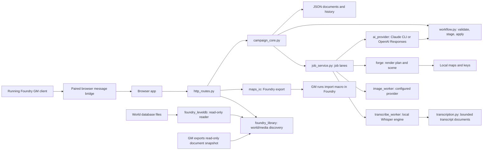

# Architecture

Campaign Studio is a single-user local app. Python serves static browser files and JSON APIs; no database
or frontend compilation is required. Runtime files are ignored by Git and excluded from release archives.

## Modules

| File                                  | Responsibility                                                                        |
| ------------------------------------- | ------------------------------------------------------------------------------------- |
| `DM/server.py`                        | Local server startup, interrupted-job recovery and worker threads                     |
| `DM/http_routes.py`                   | HTTP routes, request validation, response handling and static files                   |
| `DM/campaign.py`                      | Where the active campaign's files live; inherited by job subprocesses (`DM_HOME`)     |
| `DM/campaign_core.py`                 | Document revisions/history, map workflows and campaign-specific job results           |
| `DM/job_service.py`                   | Queueing, subprocess execution, persistent job records, logs and restart detection    |
| `DM/config.py`                        | Local settings, world manifest and Data directory detection                           |
| `DM/context.py`                       | Bounded, deterministic reference selection and prompt previews                        |
| `DM/foundry_backup.py`                | Offline full User Data copy, SHA-256 verification and restore copy receipts           |
| `DM/foundry_upgrade.py`               | Upgrade workflow: inventory, clone evidence, migration audit and cutover review       |
| `DM/foundry_compat.py`                | Shared build, version and package relationship rules                                  |
| `DM/foundry_catalog.py`               | Official Foundry release and package metadata collection                              |
| `DM/foundry_solver.py`                | Compatible build and dependency selection                                             |
| `DM/foundry_library.py`               | Local world discovery, media browsing, snapshots and codex import conversion          |
| `DM/foundry_party.py`                 | Character level, classes, AC and HP from actors and their class items; party totals   |
| `DM/memory_import.py`                 | Bounded legacy, summary and Foundry lore parsing into reviewed import candidates      |
| `DM/foundry_leveldb.py`               | Read-only, standard-library reader for the active LevelDB files of a v11+ world       |
| `DM/storage.py`                       | Atomic JSON replacement and cooperating thread/process locks                          |
| `DM/commits.py`                       | Write-ahead journal that completes interrupted multi-document changes                 |
| `DM/records.py`                       | Per-record codex/thread paths, collections and bounded list views                     |
| `DM/references.py`, `DM/map_trash.py` | Where-used links, unlinking and recoverable map trash                                 |
| `DM/schema.py`, `DM/migrate.py`       | Data schema version, migrations, verified pre-migration backups and restore           |
| `DM/shapes.py`                        | Each stored record's fields and defaults, defined once for Python and the browser     |
| `DM/workflow.py`                      | Map proposal schemas, layout DSL, stale checks, staging and content apply             |
| `DM/request_workflow.py`              | General request schema, input fingerprint, validation and idempotent apply            |
| `DM/session_workflow.py`              | Session proposal schema, links, stale review guard and recoverable session apply      |
| `DM/revisions.py`                     | Map plan/key/brief checkpoints, preview and restore                                   |
| `DM/maps_io.py`                       | Image-map import and complete exports to the selected Foundry Data directory          |
| `DM/forge/forge.py`                   | Plan parser, wall/light geometry, scene exports and catalogue registration            |
| `DM/forge/generate.py`, `gen_city.py` | Procedural generator registry and city layout generation                              |
| `DM/forge/render2d.py`, `roofs.py`    | Deterministic tiled raster painting and roof geometry                                 |
| `DM/tools/image_worker.py`            | One configured image request; parent server applies its result                        |
| `DM/transcription.py`                 | Local Whisper engines, recording checks, transcript bounds and the transcript shape   |
| `DM/tools/transcribe_worker.py`       | One local transcription in a child process; leaves segments for the server to store   |
| `DM/transcript_classifier.py`         | Transcript windows, the sorting prompt and schema, passage validation, GM review      |
| `DM/thread_ledger.py`                 | Confirmed-play windows, quoted evidence validation, reviewed changes and loose report |
| `DM/app/merge.js`                     | Copy/compare helpers, new records from shapes and the three-way autosave merge        |
| `DM/app/state.js`                     | API access, document cache, revision-aware autosave and polling                       |
| `DM/app/controls.js`                  | Shared DOM, form, picker, dialog and feedback controls                                |
| `DM/app/campaign-pages.js`            | Codex, threads, session prep, inbox and handout pages                                 |
| `DM/app/thread-ledger.js`             | Transcript ledger review and unresolved-thread report                                 |
| `DM/app/map-pages.js`                 | Map creation, editing and proposal review pages                                       |
| `DM/app/world-pages.js`               | World map page: upload an image, pin battle maps onto it                              |
| `DM/app/foundry-pages.js`             | Foundry setup, backup and upgrade views                                               |
| `DM/app/studio.js`                    | Studio shell, dashboard, World Library, settings and image queue                      |
| `DM/app/recordings-page.js`           | Recordings page: choose a file, watch the job, read and remove transcripts            |
| `DM/app/transcript-review.js`         | Sorting controls, the passage review list and the table-lore list                     |
| `DM/app/live-library.js`              | GM browser pairing, explicit live refresh and snapshot handoff                        |
| `DM/app/app.js`                       | Route dispatch and startup; one abortable view context per navigation                 |
| `DM/packaging_source.py`              | Explicit source manifest archive and SHA-256 checksum                                 |

`http_routes.ROUTES` maps methods and paths to focused handlers. The dispatcher converts typed
`Invalid`, `NotFound` and `Conflict` errors into JSON responses with 400, 404 and 409 statuses. Domain
validation errors are normalized at this boundary; document revision conflicts retain the latest document
and revision in their response.

The `DM` directory name and `wotg-maps`/`wotgForge` export identifiers are compatibility names. They do not
require the original campaign. Change export identifiers only with a migration for existing scenes.

## Persistence and concurrency

Settings, codex entries, threads, art, inbox, prep, workflows and jobs live under `DM/data`. Each codex
entry and thread has its own JSON file and revision. A map's plan, key,
generated files and checkpoints live under `DM/maps/<slug>`. Images live in `DM/uploads`.

Browser document saves use `X-Rev` and return HTTP 409 plus the latest document on conflict. The browser
merges edits by stable object IDs. Previous document versions are retained under `data/.history` (50 per
document). Server route mutations use a reentrant lock. Shared map catalogue read/modify/write holds a
`storage.file_lock`, which also coordinates forge subprocesses on Windows and POSIX. JSON replacement uses
unique temporary files. External editors must cooperate with this lock to avoid lost updates.

Changes that span documents (content and request application, codex deletion, layout application, revision restore
and generated-image links) go through `campaign_core.commit_docs`. Collection changes expand into changed
records; deletions are journaled last, after references are unlinked. Before the first write, the journal in
`data/.commits` durably records every target's new value and a digest of the bytes it replaces. Put the
record that marks the change finished (workflow or request status) last. If the server stops part way,
startup replays the entry: targets still holding their old bytes are completed and targets already written
are left alone. Each target is flushed to disk before the entry is deleted, so a power cut cannot leave a
journaled document truncated without a record to recover it from. Only the server replays entries:
`python DM/migrate.py --apply` refuses while one is pending, because replaying can queue a render. Every write request and job result also replays pending entries first, so no change starts
from a half-applied state. Follow-up steps recorded with a change (queueing the render after a layout apply
or restore, marking the map catalogue populated) run once its documents are written, and again on replay;
they are idempotent and best effort. If a target was changed some other way, nothing is overwritten; the
entry is set aside and shown on the dashboard for GM review. A damaged journal record is set aside the same
way, so it never blocks later changes. Stable workflow-derived IDs and retry checks remain a second
guard against duplicates. Map import/export are not journaled: they create files that later steps tolerate.
Back up `DM/data`, `DM/maps` and `DM/uploads` together before upgrades.

Foundry world import reads and normalizes a snapshot in `foundry_library`, then `campaign_core` commits the
snapshot and codex changes together. Codex provenance uses an opaque source-world key with a canonical
Foundry document UUID; an identical document ID in another world cannot update it. The browser loads
supported local images through the read-only Foundry asset route only while that world is selected. Macro
snapshots use the same conversion and commit path as direct folder reads.

Memory import previews older Studio collections, session-summary JSON/Markdown or selected journal folders
from the current World Library snapshot. Each candidate has a stable source-derived key and a fingerprint of
the proposed content. Apply rereads the source, rejects a changed fingerprint, maps links among chosen
records, and journals all additions and log fills through `commit_docs`. It never overwrites an existing
record or nonempty log, reads source files within size/count limits, and treats their text as reference data.
The live GM bridge also uses that path. Its browser messages require the paired opener and exact origin;
the Studio user explicitly approves the offered world, and the server validates it again. The Foundry
macro checks GM/read permission before sending bounded summaries. The existing importer updates an entry
only when its imported fields are still unchanged in Studio; it never deletes a Studio entry for a missing
Foundry document.

## Data schema and migrations

`data/.schema.json` records the campaign's data schema (`schema.CURRENT`). Existing data without it is
schema 0 (0.1.x). A new campaign records the current schema just before its first document is written, so
an older build refuses it; data copied into a campaign before its first write is still migrated. On startup the
server refuses data from a newer schema, completes interrupted changes, then migrates older data. When a
migration changes documents, every document it may rewrite is first copied to `DM/backups` and each copy is
verified by SHA-256. Migrations fill or reshape stored documents only. They are idempotent, migrated
documents are flushed to disk before the version is recorded, and an interrupted migration runs again from
a new backup. A retry's backup names the first attempt and is marked partly migrated; the pending record is
cleared once the schema version is recorded, including after an interrupted cleanup. `python DM/migrate.py`
reports pending changes, `--apply` migrates and
`--restore DM/backups/<name>` returns documents to a backup's version.

### Record shapes

`DM/shapes.py` defines each stored record once: the fields a new one needs, the defaults for the rest and
the shapes of the records in its lists (a map key's areas, an area's journal entries). Apply paths build
records with `Shape.new`, and the browser builds them with `blank(kind, fields)` from `GET /api/shapes`.
Links and provenance such as `map`, `area`, `workflow` or `request` are optional extra fields.

| Document                     | Shape         | Records in its lists                                                 |
| ---------------------------- | ------------- | -------------------------------------------------------------------- |
| `data/codex/<id>.json`       | `codex_entry` | one codex entry; unsafe legacy IDs use a hashed storage key          |
| `data/threads/<id>.json`     | `thread`      | one thread                                                           |
| `data/art.json`              | `art`         | art items                                                            |
| `data/world-maps.json`       | `world_maps`  | world maps and their pins (positions are 0-1 fractions of the image) |
| `data/transcripts/<id>.json` | `transcript`  | segments, and the passages sorted from them (`transcript_passage`)   |
| `data/ledger/<id>.json`      | `ledger`      | reviewed evidence events for one transcript (`ledger_event`)         |
| `data/table-lore.json`       | `table_lore`  | notes on gags the GM confirmed as banter (`table_lore_item`)         |
| `data/prep/<session>.json`   | `prep`        | scenes with thread clues, handouts, checklist items, loot            |
| `maps/<slug>/key.json`       | `map_key`     | areas (with journal entries, events, loot), events                   |

Migrations complete stored documents with `Shape.fill_all`, filling only missing or null fields; existing
values, unknown fields and other documents are kept. Schema 1 completed codex entries, threads, prep,
scenes, map keys and areas; schema 2 completed every shaped record. Schema 4 replaced copied Foundry import
values with a hash; schema 5 added prep archive; schema 6 added the played-session log; schema 7 split codex and thread collections into individual documents. Schema 8 added thread entry and touched-session links; schema 9 added session pitch, scene plan and handout image-brief fields; schema 10 added transcripts, schema 11 adds their passages, sorting progress and the table-lore list, and schema 12 adds separate thread ledgers. The migration
backs up old files before writing records and removes the old collections after recording the new version.
Adding a field to a shape changes
`shapes.fields_digest()`, and `tests/test_shapes.py` fails until a new schema version fills it and
`schema.SHAPES_DIGEST` is updated. Renaming or removing a field needs its own migration and fixture test.

## Workflows and jobs

| Object       | States                                                                   |
| ------------ | ------------------------------------------------------------------------ |
| Workflow     | queued/ready → running → review → applied; failed can be retried         |
| Request      | new → doing → review → done; interrupted drafts return to new            |
| Job          | queued → running → done or failed (cancelled jobs fail, `cancelled` set) |
| Image brief  | queued → generating → ready or failed                                    |
| Story thread | open, planned, foreshadowed, resolved (GM managed)                       |

Layout/content proposals are validated against a bounded schema. Layout fingerprints cover plan bytes
and numbered location identities/coordinates; changes make old proposals stale. They do not fingerprint
all codex text. Applying a layout checkpoints the map, then queues a render; applying content links entries,
journals, events, threads and art briefs. The model never calls persistence directly in structured workflows.
General Requests stage bounded JSON for codex entries, threads and session prep. The GM reviews additions
before applying; stable request-prefixed IDs and a prep application marker make interrupted writes retryable.
Editing request text or session after drafting invalidates the proposal.
The `session` request kind uses `DM/session_workflow.py`: a pitch, length, combat/social mix and selected threads
produce a recap and three to six scenes with validated NPC, thread, map and area links. It also proposes
up to two map briefs, handouts, art and thread changes. Apply checks the prep and affected threads against
the staged review snapshot, then commits the prep, records, art, map briefs and ready layout workflows with
the request's done status last. Map briefs remain pending until their separate layout workflow is reviewed;
the session apply makes no Foundry write or paid call.

Map and request drafts share `DM/context.py`. It reserves identity for linked and pinned codex records,
summarises active threads, then fills the remaining budget with linked details, name matches and a compact
codex index. Prompt/schema size is bounded by `context_budget_chars` in settings (64,000 by default); a
brief, plan or prep that alone exceeds it reports an error before provider launch. Provenance and file paths
are omitted from references. Proposal validation still checks IDs against the full codex. Both exported
packs and background jobs use this selector; `/api/context/search` and per-draft `context` actions support
the browser preview and pins.

One worker runs per lane (forge, structured drafts, art, transcribe). The draft lane retains its `claude` key in saved jobs
for compatibility; it also runs the `classify` jobs that sort transcripts. Lanes may run concurrently. `JobService` persists queue and
process transitions through an injectable runner (`SubprocessRunner`: `start`, then `feed`, `wait`, `terminate`); application callbacks settle image, workflow and inbox documents. State postprocessing
happens under the server lock, before the job is reported complete. Exceptions fail the job and leave its
worker available. On restart, the server checks the data schema, completes interrupted changes and migrates
before saved unfinished jobs are settled: a job that never started is requeued from its saved launch record
(`<id>.launch`: command and stdin, never the environment); one that was running is marked failed.
Recovery scans the full job history; the 30-job UI list remains bounded.
`POST /api/jobs/<id>/cancel` fails a queued job at once and terminates a running one; either way the
owning workflow, image brief or request is settled through the normal failure callback.
A job reports progress by printing `PROGRESS <done>/<total> [label]` or `PROGRESS <n>% [label]`; the job
API returns the last such line as `progress`. Cancelling stops the job's whole process tree, so a worker's
own children (ffmpeg, a whisper.cpp program) end with it.
Only one server instance should operate on a campaign. Direct CLI tools must not edit a map while the app
is rendering that map.

## APIs and providers

- `GET /api/state`, `/api/settings`, `/api/jobs`, `/api/doc/<name>` return local state; `/api/shapes`
  returns the stored record shapes.
- `PUT /api/doc/<name>` uses `X-Rev` and refuses application-owned documents (`settings`, `workflows/*`,
  `jobs/*`) with 403; `PUT /api/plan/<slug>` checkpoints a valid plan.
- `POST /api/maps/create`, `/api/maps/import` create maps; `/api/maps/<slug>/populate|revise` create workflows.
- `/api/workflow/<id>/pack` exports prompt/schema; POST `run|stage|feedback|apply` operates on a proposal.
- `/api/requests/<id>/pack` exports a request prompt/schema; POST `run|stage|apply` operates on its draft.
- `/api/maps/<slug>/checkpoint|restore|export` manages iteration and Foundry preparation.
- `/api/upload-image`, `/api/art/generate` handle uploaded/generated artwork.
- `/api/package` builds the public source allowlist; it never packages runtime content.
- `GET /api/state` lists interrupted changes awaiting review; POST `/api/commits/<id>/dismiss` hides one
  and keeps its saved values on disk.

Writes require `X-DM-Site: 1`. Only localhost Host values are accepted from this computer; `remote_access.AccessGate` (opt-in through `DM_BIND` and `DM_ACCESS_CODE`) admits any other request only with its session cookie, issued by `POST /login` (five wrong codes lock an address for a minute). File routes enforce canonical path
containment. The legacy file roots support older installations; normal image selection uses studio uploads.
Read-only `Website/content` references are disabled by default; enable `legacy_references` in local settings
for an existing compatible site. Local reference notes can be added as `DM/data/notes.txt`.

The image adapter posts `{model, prompt, size, n: 1}` and requires `data[0].b64_json`. It uses an environment
variable for the key and permits HTTP only on loopback. `ai_provider.py` selects Claude Code or OpenAI API
for structured drafts. Claude runs without file/shell tools; `openai_worker.py` sends the existing schema
through the Responses API with an empty tool list and `store: false`. The fixed HTTPS endpoint receives the
prompt and an environment-provided API key; settings keep only the variable name. Both providers use the
same validation, GM review, cancellation and retry flow. Exported prompt packs permit other assistants.
Old `/api/claude` calls use the selected structured request runner. The OpenAI path has synthetic tests;
it has not been exercised with a paid API call.

The owner's own use needs no API key: drafting goes through the signed-in Claude Code CLI, and session
recordings are transcribed locally (W68), sorted into play and banter (W69), then proposed as a reviewed
thread ledger (W70). Arc options and automatic runs remain W71–W73 in `docs/ROADMAP.md`. The OpenAI provider
is optional.

## Session recordings

`GET /api/recordings?path=` lists the media files in a folder (not its subfolders; default: the campaign's
`Session recordings` folder) or describes one file, and marks those that already have a transcript.
`POST /api/transcripts/start {path, session?}` queues a job on the `transcribe` lane; a recording already
being transcribed answers 409. `GET /api/transcripts` lists transcripts without their segments, `GET
/api/transcripts/<id>?offset=&limit=` reads a window of segments (at most 500), and `POST
/api/transcripts/<id>/remove` deletes only Studio's transcript.

A recording is identified by `rec-` plus a hash of its path, size and modification time, so starting the same
file again replaces one transcript instead of adding another, and a changed or moved file is a new one. The
server validates the path (`storage.local_path`: an existing local, unlinked file with a media extension),
then the job's stdin carries a JSON request (recording, engine settings, result and scratch paths) to
`tools/transcribe_worker.py`. The worker runs the engine selected in settings (`transcription.PROVIDERS`:
`faster-whisper` in-process, or `whisper-cpp` with ffmpeg), prints progress and writes its segments to
`jobs/<id>.transcript`. It writes no campaign document. When the job finishes the server validates the
segments (ordered, finite, text bounded to 2,000 characters a segment, 20,000 segments and 2 MB of text; a
longer recording keeps its start and says so), writes `transcripts/<id>` (`shapes.TRANSCRIPT`),
and removes the staged result and the scratch audio, also after a failure, cancel or restart. A model is
downloaded only when `transcription.allow_download` is set. Transcript text is what was said at the table:
reference data, never instructions. The recording is only read; nothing is uploaded.

### Play, banter and table lore

A transcript is also what was joked about, so a second step separates the game from the table
(`transcript_classifier.py`). `POST /api/transcripts/<id>/classify {restart?}` queues a `classify` job on the
draft lane for the window at the transcript's cursor: whole segments up to 30,000 characters and the draft
context budget. The prompt carries the instruction, the saved table-lore notes (newest first, 6,000
characters at most), the last three earlier passages' gists and the numbered segments; the transcript is data,
never instructions. The answer is `SCHEMA` (passages with first and last segment, kind, gist, an optional
`remember` note and a matched `lore` ID) from the configured provider (Claude Code, or the OpenAI worker).
`finish_classification` validates it in `passages_from`: numbers are clipped to the window, a passage that
starts inside an earlier one keeps only what follows, a segment the model left out becomes an `unclear`
passage, a `lore` ID must exist, and only banter keeps a note, so no segment is read as play by omission. It
stores the passages (`passages`, each `confirmed: false`) and queues the next window until the cursor reaches
the end (`classification.status` `done`). Each window is its own job, so Cancel, usage totals and restart
recovery behave as for other drafts: a failed, cancelled or interrupted window sets `failed` with the
reason and the cursor stays, and the same endpoint resumes from it. Work in earlier windows, including the
GM's decisions, is kept; `restart` forgets passages but not table lore. A transcript is busy (409) while it
is being transcribed or sorted, and transcribing a sorted recording again needs `replace: true`.

`GET /api/transcripts/<id>/passages?show=pending|known|confirmed|all&offset=&limit=` pages the review list
with times and an excerpt of each passage; list cards also carry `review` counts and the `plan` (requests and
characters) shown before sorting starts. `POST /api/transcripts/<id>/review {decisions}` takes `{id, kind?,
confirmed?, remember?}` items: only in-game or banter can be confirmed, and the transcript and table lore are
written together with `commit_docs`. Confirming banter with a note saves `table-lore` item
`<transcript>-<passage>`, one per passage, so repeats add nothing; undoing it, calling the passage play or
emptying the note removes that item. `GET /api/table-lore` and `POST /api/table-lore/<id>/remove` manage the
list (200 notes at most); removing an item clears the match on every passage that used it, in every
transcript, in the same commit. Known-lore passages sit outside the pending count, and the GM can still call
one in-game. The step's only output is `confirmed_play(transcript)`: passages the GM confirmed as in-game,
with their segments and times. Banter, unclear and unconfirmed passages never leave it, whatever a model
proposed. `table-lore` and transcripts are application-owned documents the generic document save refuses.

### Confirmed-play thread ledger

`POST /api/transcripts/<id>/ledger/start` requires completed sorting, no pending decisions, at least one
confirmed in-game passage and an existing linked prep. `POST /api/transcripts/<id>/ledger/session {session}`
can link a transcript to a prep without transcribing it again. The server reads only
`transcript_classifier.confirmed_play`, divides its segments into windows within the context budget, and
queues each `thread-ledger` draft on the normal structured provider lane. Each window returns thread,
codex-note or session-outcome events. `thread_ledger.validate_batch` requires a passage ID and an exact,
bounded quote inside that window's confirmed play; it derives the timestamp from the segment rather than
accepting one from the model. Banter, unclear and unconfirmed passages cannot validate as evidence. The
prompt treats all transcript and campaign text as reference data, with no provider tools.

One `ledger/<transcript-id>` document (`shapes.LEDGER`, schema 12) holds staged events, a confirmed-play
fingerprint, window cursor and target revisions. A failed or cancelled window keeps earlier validated
events and resumes at the cursor. `GET /api/transcripts/<id>/ledger` presents the draft without internal
revision data. `POST /api/transcripts/<id>/ledger/apply {selected}` accepts only IDs in that draft, checks
the transcript fingerprint and selected target revisions, then writes only selected per-record threads and
codex notes, prep log outcomes, and the applied ledger marker through `commit_docs` with the marker last.
A retried apply returns the applied marker without appending again. Existing custom fields remain. Quotes
and times stay in the ledger and in the edited record text. `GET /api/threads/loose?hero=` returns open,
planned and foreshadowed threads sorted by last touched session, with hero links and the selected ledger
evidence. No event changes the campaign until the GM applies it.

## Foundry boundary

The world picker reads `world.json` for identity and system information. The World Library reads selected
local media under `Data` and the world's scenes, journals, actors and items, read from its database files
(`foundry_leveldb` for v11+ worlds, following `CURRENT` and `MANIFEST` to exclude retired files; one JSON
document per line for v10 and earlier) or from a GM-exported
snapshot. A GM-run Script macro can instead send a fresh snapshot from the running Foundry client to a
paired Studio tab on request, without direct cross-origin API access. All three paths pass
`normalize_snapshot`, which validates the chosen world and stores only bounded
summaries under Studio's private `DM/data`. A folder-read snapshot records a fingerprint of the database
files, so the page re-reads when they change. The reader opens no database, takes no lock and writes
nothing. The browser bridge is read-only and lasts while both tabs stay open; it does not synchronize edits
back to Foundry. Assets and JSON are copied to
`Data/wotg-maps`; the user runs the macro as GM. No world database is written by Python. Imported documents
carry stable studio IDs and generated ownership flags. Reimports preserve custom tokens/notes/journal pages
and unmanaged walls/lights for modern managed imports; older untagged scenes may need explicit wall replacement.

The exported scene schema targets v12. The standalone GM macro selects an adapter for v11, v12 or v13
scene fields and roof tiles; D&D 5e gets descriptive NPC/item sheets, while other systems get journal
content. Fixture contracts cover these combinations and tagged reimport ownership. The live GM checks in
`docs/FOUNDRY_IMPORT.md` remain necessary. Foundry write-back, mechanical stat block
adapters and v14 support are future work.

The Foundry backup service reads the selected world manifest to locate its User Data folder. It copies that
whole folder only while Foundry is closed, records and verifies every file checksum, and can materialize a
restore in a separate new folder. The app does not migrate a Foundry database or overwrite a live world.
